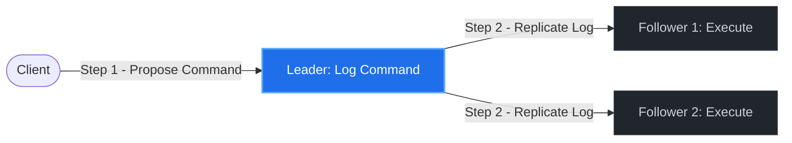
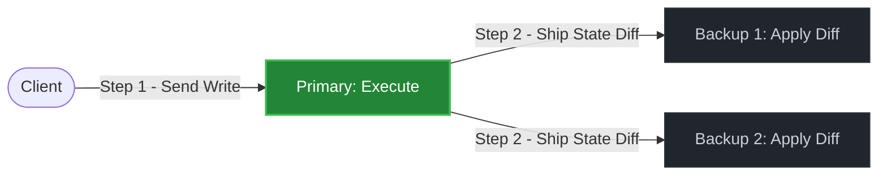
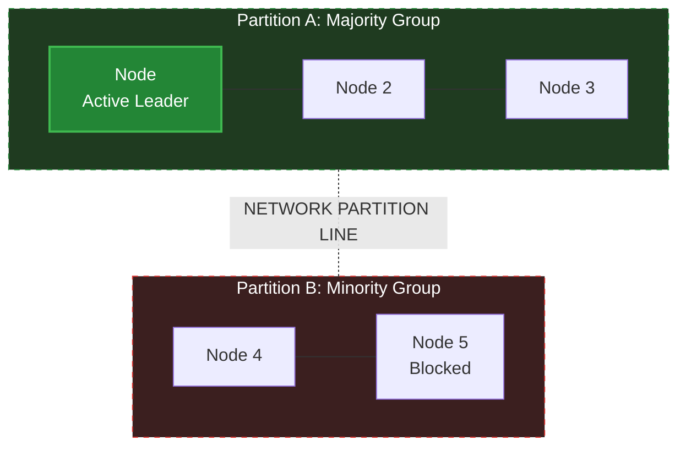

# Distributed Systems - Episode 2: State Machine Replication (Ahmed Farghal)

> [!quote] Engineering Reality
> 
> "Replicating state directly is a network nightmare; replicating deterministic inputs to rebuild state locally is how we build high-performance, fault-tolerant engines."

## 1. The Core Architectural Trade-Off: Active vs. Passive Replication

When replicating stateful systems, you must choose where the computation happens. This choice dictates your bottleneck (CPU vs. Network).

### Active Replication (SMR)

- **CPU-bound** across the cluster; ultra-compact network payloads.
    

### Passive Replication (Primary-Backup)

- **CPU-bound** on Primary only; high network bandwidth consumption.
    

### Deep-Dive Trade-off Matrix

|                           |                                                            |                                                                   |
| ------------------------- | ---------------------------------------------------------- | ----------------------------------------------------------------- |
| **Metric / Dimension**    | **Active Replication (SMR)**                               | **Passive Replication (Primary-Backup)**                          |
| **Execution Point**       | **Every replica** runs the execution logic.                | **Primary node only** runs the execution logic.                   |
| **Replicated Payload**    | Raw command / input parameters (e.g., `set(x, 1)`).        | Computed state changes / memory diffs / WAL pages.                |
| **Network Overhead**      | **Low.** Only small command strings are sent.              | **High.** Shifting binary diffs/state maps scales with data size. |
| **CPU Overhead**          | **High.** $N$ replicas do the exact same work redundantly. | **Low.** Backups only do memory copying/page writes.              |
| **Determinism Tolerance** | **Zero tolerance.** Code must be strictly deterministic.   | **High.** Primary resolves non-determinism before shipping state. |
| **Failover Cost**         | **Zero/Instant.** Follower state machines are already hot. | **High.** Backup must apply queued diffs and verify consistency.  |

## 2. The Non-Determinism Battlefield

Under Active SMR, if two replicas process the same input but arrive at different states ($S_{\text{replica1}} \neq S_{\text{replica2}}$), the cluster diverges. Real-world systems use strict constraints to isolate and eliminate non-deterministic vectors:

### A. Physical Clocks (`System.currentTimeMillis()`)

- **The Trap:** Replicas running commands at slightly different times evaluate time-based branches differently.
    
- **The Engineering Fix:** **Context Injection.** The Leader captures its local physical clock _at the moment of log proposal_ and injects it into the log entry payload (e.g., `cmd: "delete_user", timestamp: 1719690600`). Replicas are physically blocked from calling their local clock; they _must_ read the injected timestamp as their source of logical truth.
    
### B. Randomness & Unique ID Generation (`UUID.randomUUID()`)

- **The Trap:** Generating random bytes on the fly causes instant state divergence.
    
- **The Engineering Fix:** Replicas must use pseudo-random generators initialized with a **replicated seed** provided in the consensus log entry, or the Leader pre-generates the UUID and replicates it explicitly.
    
### C. OS-Level Concurrency & Multi-threading

- **The Trap:** Multi-threaded execution pools interleave writes based on the OS scheduler, leading to divergent race conditions.
    
- **The Engineering Fix:** The final state-application layer must run on a **single execution thread** sequentially processing the log, or use deterministic locking schedulers.
    
## 3. The Split-Brain Proof (The Majority Quorum Line)

In a network partition, the cluster is physically divided into isolated groups. If multiple groups act as leaders and accept writes, the state machine diverges irreparably.

### Mathematical Guarantee of Single-Leader Progress

Let the total number of nodes be $N$. The system requires a strict majority quorum $Q$ to make any progress:
$$Q \ge \left\lfloor \frac{N}{2} \right\rfloor + 1$$

If a partition splits the cluster into two isolated groups, $A$ and $B$, such that:
$$|A| + |B| = N$$

If Partition $A$ successfully gathers a quorum ($|A| \ge Q$):
$$|B| = N - |A|$$$$|B| \le N - Q$$

Substituting $Q = \lfloor \frac{N}{2} \rfloor + 1$ into the inequality:
$$|B| < \lfloor \frac{N}{2} \rfloor + 1 \implies |B| < Q$$

**Conclusion:** It is mathematically impossible for both sides of a partition line to achieve quorum simultaneously. Only the majority partition can proceed; the minority partition is forced to stall writes, fully preventing split-brain.

## 4. Performance Optimizations (The True Engineering Gems)

In naive designs, running a full consensus protocol round-trip for every single database mutation kills performance. Production-grade systems implement several performance optimization mechanisms:

### A. The Consensus Bypass Optimization (Leader-Only Writes)

- **The Insight:** You do **not** need to run multi-round consensus (e.g., full Paxos/Raft negotiations) for every single database write.
    
- **The Mechanism:**
    
    1. Use consensus **only** to agree on who the _Leader_ is (Leader Election).
        
    2. Once a stable, unchallenged Leader is established, the leader acts as a central sequencer.
        
    3. The leader appends client writes directly to followers in a fast-path replication protocol (similar to Primary-Backup) without running a full consensus voting phase for each write.
        
    4. Consensus is only re-triggered if a failover is detected and a new leader needs to be elected.
        
### B. Read Path Optimizations (Bypassing the Write Log)

Writing to the log to perform a _read_ is highly inefficient. However, reading directly from any follower can return stale data (violating linearizability).

#### 1. Read-Index Method

- When a follower receives a read request, it queries the leader for the current globally committed log index ($C_{\text{index}}$).
    
- The follower stalls the read request until its local state machine has caught up and executed up to $C_{\text{index}}$, ensuring it does not return stale state.
    
#### 2. Lease-Based Reads (Physical Time Optimization)

- The leader is granted a physical, time-bounded **Lease (**$L$**)** by the followers.
    
- During the lease duration, followers guarantee they will not initiate elections or vote for any other leader.
    
- Because the leader knows with absolute certainty that no other node can claim leadership during this window, **the leader can serve reads instantly from its local in-memory state with zero network hops.**